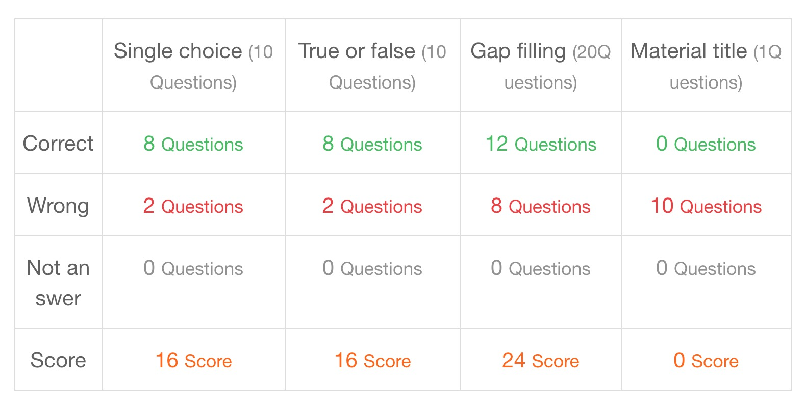

---
params:
  lesson: "Exam"
  title: ""            
  link: "https://moocs.unipus.cn/course/373/task/27612/show"
  content: ""  
  date: !r Sys.Date()
  email: matthew.malishev@gmail.com    
  # end inputs ---------------------------------------------------------------
header-includes: \usepackage{float}
always_allow_html: yes
output:
  html_document 
---

```{r echo = FALSE}
# library(rmarkdown)
# setwd("")
# f <- list.files()[1]
# render(f, output_format='pdf_document')
```

```{r, set-options, echo = FALSE, cache = FALSE}
options(width=100)
knitr::opts_chunk$set(
 eval = TRUE, # run all code
 # echo = FALSE, # show code chunks in output 
 comment = "",
 tidy.opts=list(width.cutoff=100), # set width of code chunks in output
 tidy=TRUE, # make output as tidy
 message = FALSE,  # mask all messages
 warning = FALSE, # mask all warnings 
 size="small" # set code chunk size
)

# https://github.com/ucb-stat133/stat133-fall-2016/blob/master/hws/hw02-tables-ggplot.Rmd
knitr::opts_knit$set(root.dir=paste0(params$dir,"/")) # set working dir

setwd(paste0(params$dir,"/")) # for running just in R not knitr
```

\  

\  

\  

\  

# `r paste0(params$lesson,": ",params$title)`    
\  

Content for `r params$lesson`  
`r params$content`      
\  

<!-- ____________________________________________________________________________ -->
<!-- ____________________________________________________________________________ -->
<!-- ____________________________________________________________________________ -->
<!-- start body -->  
  
## `r params$title`      

### Fill in the gaps  
  
1.  
上课的时候，老师让同学们__________。  
A.  
读课文  

\  

2.  
妈妈说她很忙，没时间做饭，她叫我__________。
B.  
做饭  

\  

3.  
马丁，__________。  
B.
请你告诉玛丽  

\  

4.  
A教室里大家正在B考试C。 （安静地）  
B.
教室里大家正在安静地考试。  

\  

5.  
每天A孩子们B都C去学校上学D。 （高兴地）  
C.
每天孩子们都高兴地去学校上学。  

\  

6.  
那个饭馆的菜真好吃A，B昨天C我们D吃了一顿。 （美美地）  
D.
那个饭馆的菜真好吃，昨天我们美美地吃了一顿。  

\  

7.  
最近我太累了，A真B想C睡一天D。 （舒舒服服地）    
C.
最近我太累了，真想舒舒服服地睡一天。  

\  

8.  
天气太冷了，我们A回B房间C吧。 （去）    
天气太冷了，我们回房间去吧。  

\  

9.  
你等着A，我马上B下C去D。 （楼）   
B.
你等着，我马上下楼去。   

\  

10.  
我从学校A借B了C一本词典。 （来）    
B.
我从学校借来了一本词典。  

\  

### True or false  

11.     
奶奶给了一本书他。  
F  

\  

12.  
老师问了我一个问题。  
T  

\  

13.  
大家都他叫大哥。  
F 

\  

14.  
他比我五公斤重。  
F   

\   

15.  
麦克三岁大比山田  
F  

\  

16.  
这件大衣贵比那件300块。  
F 

\  

17.  
昨天我去超市了。  
T  

\  

18.  
明天我也去超市了。  
F 

\  

19.  
我游泳了一个小时。  
F  
  
\  

20. 
我们写了汉字半个小时。  
F  
  
\  

### Rewrite the sentence in correct order     

21.  
朋友 送给 把 她的手机 我 了    
朋友把她的手机送给我了  

  
\  

22. 
email 把 发给 我 玛丽 没    
我没把email发给玛丽  
  
\  

23. 
了 我 他 把 那套房子 卖给  
我把那套房子卖给他了    

\  

24.  
一定 那本书 带给 你 他 要 把  
你一定要把那本书带给他    

\  

25. 
我们 去 颐和园 骑自行车   
我们骑自行车去颐和园  
  
\  

26.   
玛丽 学校 走路 每天 去  
玛丽每天走路去学校   

\  

27. 
这儿 吃饭 来 朋友们 常常  
朋友们常常来这儿吃饭  

\  

28. 
一起 回国 我们 坐飞机  
我们一起坐飞机回国

\  

29. 
一样 她的裙子 我的 跟    
她的裙子跟我的一样   

\  

30.   
难道 不是 好朋友 他 你的 吗       
他难道不是你的好朋友吗    

\  

### Fill in the blanks  

31.   
我1.80cm高，我哥哥1.82cm高。我没有(1)。 (“A没有B+ADJ”)  
他高  

\  

32.   
天津没有(1)。 (“A没有B+ADJ”)  
北京大  

\  

33.   
从这儿到天安门的交通很方便，(1)。 （怎么……都……）    
怎么去都行   

\  

34.   
我不忙，你(1)。 （什么时候……都……）  
什么时候找我都可以   

\  

35.   
A：他去哪儿了？  
B：他一句话也没说。(1)？ （谁）  
谁知道他去哪儿了   
(谁知道)  

\ 

36.   
A：你知道她什么时候回来吗？  
B：我不认识她，我(1)？ （哪儿）    
哪儿知道    
(哪儿都没去过)       

\  

37.   
请把这篇文章(1)汉语。（V+成）     
翻译成    

\  

38.   
今天上课的时候，我把“剧场”(1)“机场”了。（V+成）  
说成    


\  

39.  
天气太冷了，我们(1)吧。 （V+来/去）    
进去      

\  

40.  
这个电影没有英文字幕，我(1)。 （V+得/不+懂）    
看不懂  
(听不懂)    

### Select the appropriate option and complete the sentence.  
  
A. 玛丽的是白的  
B. 那本也是我的  
C. 她喜欢蓝色的  
D. 爸爸的是旧的  
E. 那是姐姐的  
F. 这个小的不是他的  
G. 满头大汗  
H. 跳了起来  
I. 肚子疼  
J. 说不出话来  

\  

41.   
这本书是我的，(1)。  
B

\  

42.   
这是哥哥的自行车，(1)。  
E  

\  

43.  
安妮的衬衫是红的，(1)。  
A  

\  

44. 
那个大本子是马丁的，(1)。  
F     

\  

45. 
妈妈的牛仔裤是新的，(1)。  
D  


\  

46. 
我喜欢红色的旗袍，(1)。。  
C  

\  

47. 
他高兴得(1)。  
H  

\  

48. 
马丁饿得(1)。     
I   

\  

49. 
这个孩子热得 (1)。  
G  

\  

50.   
小李累得(1)。  
J  


   
