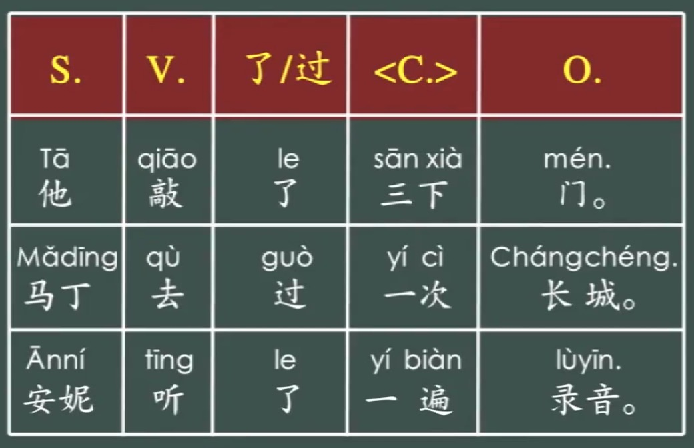
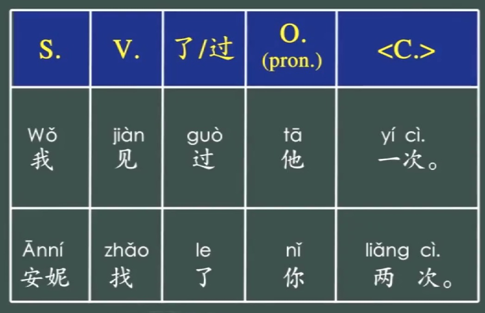

---
params:
  lesson: "Lesson 5.2"
  title: "Complement of frequency"            
  link: "https://moocs.unipus.cn/course/373/task/27612/show"
  content: "下，次，遍"  
  date: !r Sys.Date()
  email: matthew.malishev@gmail.com    
  # end inputs ---------------------------------------------------------------
header-includes: \usepackage{float}
always_allow_html: yes
output:
  html_document 
---

```{r echo = FALSE}
# library(rmarkdown)
# setwd("")
# f <- list.files()[1]
# render(f, output_format='pdf_document')
```

```{r, set-options, echo = FALSE, cache = FALSE}
options(width=100)
knitr::opts_chunk$set(
 eval = TRUE, # run all code
 # echo = FALSE, # show code chunks in output 
 comment = "",
 tidy.opts=list(width.cutoff=100), # set width of code chunks in output
 tidy=TRUE, # make output as tidy
 message = FALSE,  # mask all messages
 warning = FALSE, # mask all warnings 
 size="small" # set code chunk size
)

# https://github.com/ucb-stat133/stat133-fall-2016/blob/master/hws/hw02-tables-ggplot.Rmd
knitr::opts_knit$set(root.dir=paste0(params$dir,"/")) # set working dir

setwd(paste0(params$dir,"/")) # for running just in R not knitr
```

\  

\  

\  

\  

# `r paste0(params$lesson,": ",params$title)`    
\  

Content for `r params$lesson`  
`r params$content`      
\  

<!-- ____________________________________________________________________________ -->
<!-- ____________________________________________________________________________ -->
<!-- ____________________________________________________________________________ -->
<!-- start body -->  
  
## `r params$title`      

### Using 下，次，遍  

### Scenario 1  
#### When the object is a noun, the object follows the complement   
#### S + V + 了/过 + complement + O    

  

He knocked on the door three times.  
Martin went to the Great Wall once.  
Anni listened to the recording from start to finish.  

\  

### Scenario 2    
#### When the object is a pronoun  (我，你们，etc), the object comes before the complement    
#### S + V + 了/过 + O (pronoun) + complement    
  
      
I met him once.  
Anni searched for you twice.      

### Exceptions (both scenarios)    
When the object is very long, it generally goes before the subject.        

E.g.  
这个电影我已经看过两遍了。       

\  

******      
  
## Test question        


### 下    
measure word for verbs  
indicates frequency of action  

V + number + momentum word    

Verb measure words when combined with numerals serve as complements after verbs    
E.g.  
他敲了三下门      
三下 complements 敲     

### 次  
Denote the frequency of an action  

我去过一次上海   
我吃过两次饺子  
我看过三次汉语电影    
我坐过很多次地铁    
I have taken the subway many times  

### 遍  
Repetition of a process from start to finish  

我听了一遍录音   
I listened to the recording from beginning to end.       
读了一遍课文  
I read the text from beginning to end.       

一个汉字写五遍    
Write a Chinese character five times over.      

这个电影我看了三次，看完了一遍又一遍。   
I watched this movie three times, I watched it once from beginning to end.    

V了 + 一遍又一遍 = again and again 
V了 + 一次又一次 = again and again      

\  

******      
    
## Examples   
 
对不起， 请你再说一遍，好吗？  
Sorry, can you please say it again from start to finish?  

大卫今天来找过你好几次。快给他回个电话。   
David visited you several times today. Quick call him back.    

这本书我在书店看到过几次，但是没买。  
I saw this book a few times in the bookstore, but I didn't buy it.   
 
这个电影我已经看过两遍了，不想在看了。    
I have watched this movie twice, I don't want to watch it anymore.     

这首歌我在电视里听到过几次，可是从来没听完一遍。   
I have heard this song several times on TV, but never heard it from start to finish.  


\  

******      
  
## Quiz  
  
Fill in the blank using 下，次，or 遍。  
  
1.  
这张光盘我已经看过好几(1)了。   
遍   

2.  
我认识林月，我们见过一(1)面。  
次  

3.
今天的听力练习很难，我听了三(1)才听懂。  
遍    

4.  
他敲了三(1)门，屋里没人。  
下        

5.  
这个电影我听同屋介绍过两(1)了，等有时间一定要好好儿看一(2)。    
次  
遍 

6.  
去年我跟旅行团去海南旅行过一(1)。  
次  

Complete the sentence with the bracketed term  
  
7.  
你去过几次颐和园？（2次）  
去过两次颐和园   

8.  
昨天的课文你读了几遍？（3遍）  
课文我读了三遍    

9.  
你一个星期给妈妈打几次电话？（3次）  
给妈妈打三次电话  

10.  
听力练习，每个录音听几遍？（2遍）  
每个录音听两遍   

