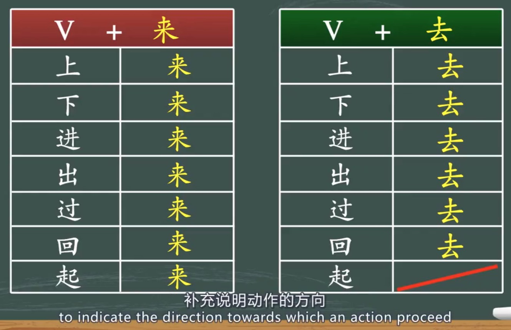

---
params:
  lesson: "Lesson 5.4"
  title: "Compound directional complements"            
  link: "https://moocs.unipus.cn/course/373/task/27612/show"
  content: ""  
  date: !r Sys.Date()
  email: matthew.malishev@gmail.com    
  # end inputs ---------------------------------------------------------------
header-includes: \usepackage{float}
always_allow_html: yes
output:
  html_document 
---

```{r echo = FALSE}
# library(rmarkdown)
# setwd("")
# f <- list.files()[1]
# render(f, output_format='pdf_document')
```

```{r, set-options, echo = FALSE, cache = FALSE}
options(width=100)
knitr::opts_chunk$set(
 eval = TRUE, # run all code
 # echo = FALSE, # show code chunks in output 
 comment = "",
 tidy.opts=list(width.cutoff=100), # set width of code chunks in output
 tidy=TRUE, # make output as tidy
 message = FALSE,  # mask all messages
 warning = FALSE, # mask all warnings 
 size="small" # set code chunk size
)

# https://github.com/ucb-stat133/stat133-fall-2016/blob/master/hws/hw02-tables-ggplot.Rmd
knitr::opts_knit$set(root.dir=paste0(params$dir,"/")) # set working dir

setwd(paste0(params$dir,"/")) # for running just in R not knitr
```

\  

\  

\  

\  

# `r paste0(params$lesson,": ",params$title)`    
\  

Content for `r params$lesson`  
`r params$content`      
\  

<!-- ____________________________________________________________________________ -->
<!-- ____________________________________________________________________________ -->
<!-- ____________________________________________________________________________ -->
<!-- start body -->  
  
## `r params$title`      

Table of common usages   
  

When object refers to a location, e.g. 房间    
。。。 V + OBJ + 去/来    
。。。 上/下/进/出/回/过/起 + 他 + 去/来  
E.g. 
他跑进房间里来了。  
He came into the room.  

When the object refers to a person or thing, it can be placed either before or after 去/来    
。。。 V + 去/来 + OBJ      
。。。 上/下/进/出/回/过/起 + 去/来 + 东西     
  

\  

******      
    
## Examples   


跑出来   
走出来  
Run out  
Walk out  

他跑进来了   
他走进来了   
He ran in.    
He walked in.   

他跑出去了   
他走出去了   
He ran out.  
He went out.  
 
他走上来了。   
他走上去了。  
He came up.   
He went up.    

他跑下去了。(A - B)    
和跑下来了。(B - A)    
He ran down   

他跑过来了。 (A - B)    
他跑过去了。 (B - A)    
He ran over, e.g. crossing the street. 
 
他跑回去了。(A - B)          
他跑回来了。(B - A)         
He ran back , e.g. crossing the street.   
 
他走上楼去了。   
He went up a storey.     

******   

When the object refers to a location, you can turn A into B, e.g.      

A. 他拿出来一本书。    
B. 他拿出一本书来。      


\  

******      
  
## Quiz  
  
1.  
马(Mǎ)丁(dīng)第(dì)一(yī)个(gè)__________了(le)，他(Tā)是(shì)冠(guàn)军(jūn)。  
跑过来   


2.  
我(Wǒ)给(gěi)你(nǐ)们(men)__________了(le)几(jǐ)张(zhāng)照(zhào)片(piàn)。     
发(fā)过(guò)去(qù)  

3.  
听(Tīng)见(jiàn)有(yǒu)人(rén)敲(qiāo)门(mén)，她(Tā)马(mǎ)上(shàng)__________开(kāi)门(mén)。  
站(zhàn)起(qǐ)来(lái)  

4.  
她(Tā)从(cóng)书(shū)包(bāo)里(lǐ)__________一(yī)本(běn)书(shū)。  
拿(ná)出(chū)来(lái)   

5.  
我(Wǒ)从(cóng)大(dà)卫(wèi)那(nà)儿(r)__________一(yī)辆(liàng)自(zì)行(xíng)车(chē)。  
借(jiè)回(huí)来(lái)   


6.  
他(Tā)们(men)已(yǐ)经(jīng)快(kuài)到(dào)山(shān)顶(dǐng)了(le)，咱(Zán)们(men)快(kuài)点(diǎn)儿(ér)爬(pá)(1)吧(ba)。  
上去  

7.  
太(Tài)累(lèi)了(le)，咱(Zán)们(men)坐(zuò)(1)休(xiū)息(xī)一(yì)会(huì)儿(er)吧(ba)。  
下来    

8.  
看(Kàn)见(jiàn)我(wǒ)以(yǐ)后(hòu)，他(Tā)走(zǒu)(1)给(gěi)我(wǒ)一(yī)本(běn)书(shū)。  
过来   

9.  
小(Xiǎo)心(xīn)点(diǎn)儿(ér)，别(Bié)从(cóng)楼(lóu)上(shàng)摔(shuāi)(1)。  
下去   

10.  
我(Wǒ)到(dào)车(chē)站(zhàn)的(de)时(shí)候(hòu)，汽(Qì)车(chē)刚(gāng)开(kāi)(1)，我(Wǒ)只(zhǐ)好(hǎo)等(děng)下(xià)一(yī)辆(liàng)车(chē)。  
 过去   

11.  
我(Wǒ)刚(gāng)才(cái)看(kàn)见(jiàn)他(tā)从(cóng)图(tú)书(shū)馆(guǎn)走(zǒu)(1)，去(Qù)了(le)旁(páng)边(biān)的(de)小(xiǎo)卖(mài)部(bù)。  
出来  


