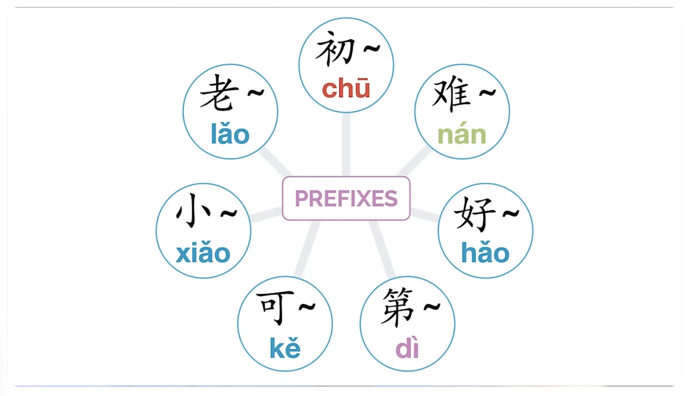
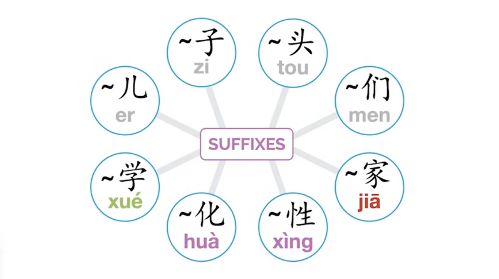

---
params:
  lesson: "Tones"
  title: Tones and pronounciation    
  link: "https://www.youtube.com/watch?v=FlaJ12tmtu4"
  content: "Tones, tongue position"  
  date: !r Sys.Date()
  email: matthew.malishev@gmail.com    
  # end inputs ---------------------------------------------------------------
header-includes: \usepackage{float}
always_allow_html: yes
output:
  html_document 
---

```{r echo = FALSE}
# library(rmarkdown)
# setwd("")
# f <- list.files()[1]
# render(f, output_format='pdf_document')
```

```{r, set-options, echo = FALSE, cache = FALSE}
options(width=100)
knitr::opts_chunk$set(
 eval = TRUE, # run all code
 # echo = FALSE, # show code chunks in output 
 comment = "",
 tidy.opts=list(width.cutoff=100), # set width of code chunks in output
 tidy=TRUE, # make output as tidy
 message = FALSE,  # mask all messages
 warning = FALSE, # mask all warnings 
 size="small" # set code chunk size
)

# https://github.com/ucb-stat133/stat133-fall-2016/blob/master/hws/hw02-tables-ggplot.Rmd
knitr::opts_knit$set(root.dir=paste0(params$dir,"/")) # set working dir

setwd(paste0(params$dir,"/")) # for running just in R not knitr
```

\  

\  

\  

\  

# `r paste0(params$lesson,": ",params$title)`      
## `r params$content`        
\  

<!-- ____________________________________________________________________________ -->
<!-- ____________________________________________________________________________ -->
<!-- ____________________________________________________________________________ -->
<!-- start body -->  
  
## Vocal range  

1st = hightest natural  tone  
2nd = mid to highest   
3rd = mid to low to mid (zombie saying 'brains')   
4th = highest to lowest (telling dog no)   
\  

## Tones   
b, d, g = softer than English, like beatboxing  
t, p, k = more breathy than English  
\  

******    


## Tongue position  

zh, ch, sh, r = roof of mouth     
z, c = centre teeth   
j, q, x = behind bottom teeth     
\  

  
\    

******    

## Prefixes - 6 primary prefixes*     
7th is '初' but only used  for zodiac calendar   
\  
 
   
\  

### 老  
Old   
For familiarity or seniority     

老婆 wife   
老外 foreigner  

### 小    
Young  

小猫 kitten  
小狗 puppy   

### 好 and 难
Good and bad  

好看 pretty    
难看 ugly   
好吃 delicious    
难吃 gross/not delicious  

### 可  
Adds ～able     

可爱 lovable/cute  
可笑 laughable      

### 第  
Makes numbers ordinal  

第一 first  
第二十 twentieth  
\  

******  

## Infixes  
\      

### 得 and 不   
Used between verb and result to indicate if that verb can be achieved       
Not used with all verbs but used with common ones    

听懂 to understand through listening      
- 听得懂 Can understand/understandable       
- 听不懂 Not understandable   

吃完 finish eating   
- 吃得完 can finish eating  
- 吃不完 cannot finish eating   
\  

******  

## Suffixes  
Characters attaxhed to ends of words or compounds to give different meaning  
\  


     
\    

###  儿    
Makes word more casual  


### 子    


### 头    


### 们  


### 家      


### 性    


### 化  


### 学      


那儿  


